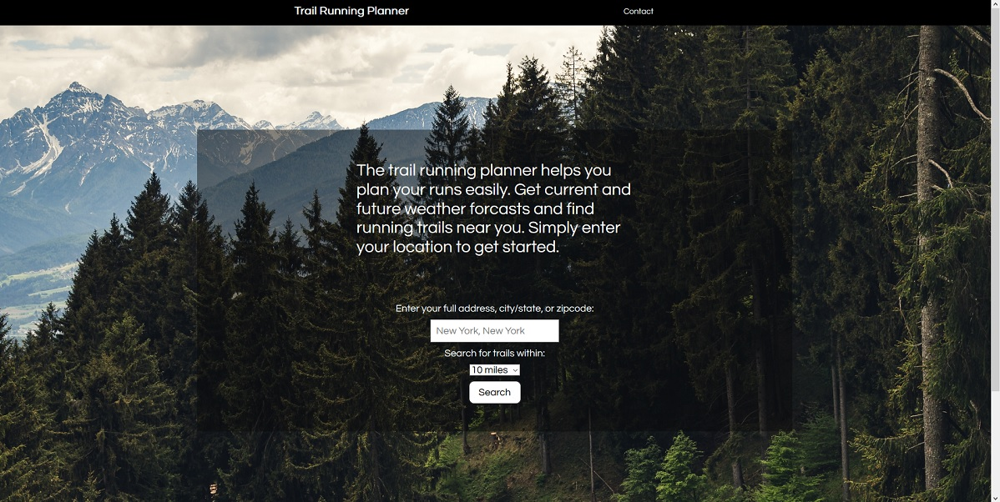
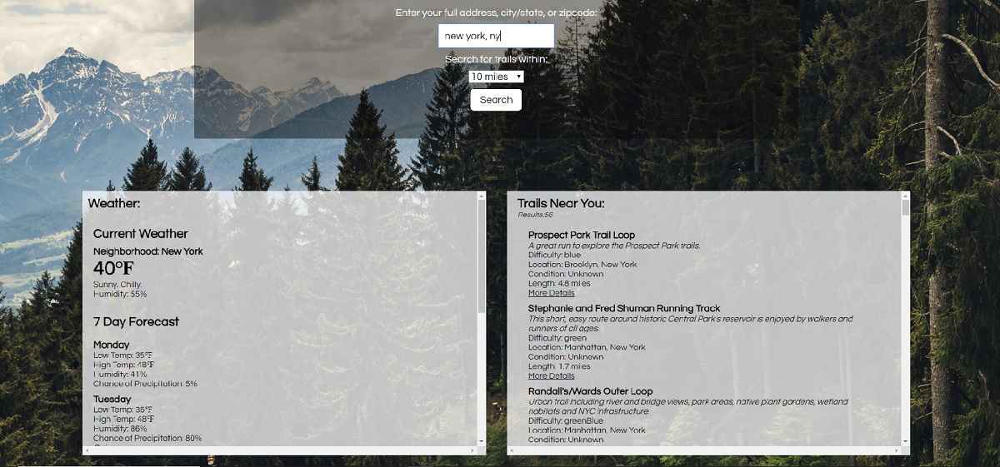
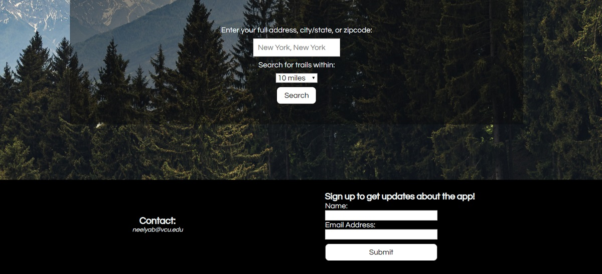

# Trail Running Planner App
The trail running planner app helps plan your runs more easily. The user submits their full address, city and state, or zip code and the maximum distance they would like to travel to the trail. The app then displays current weather, 7 day forcast, and trails within the selected distance. Details of the trails include difficulty, distance of the trail, condition of the trail, and a link to the trail page for more in depth information.

# Live Link 

(https://neelyab.github.io/trail-running-app/)

# Screenshots

# Technology Used

* HTML
* CSS
* Javascript
* jQuery

# APIs Used

* Google Geocoding API
* Trail Run Project Data API
* Destination Weather API